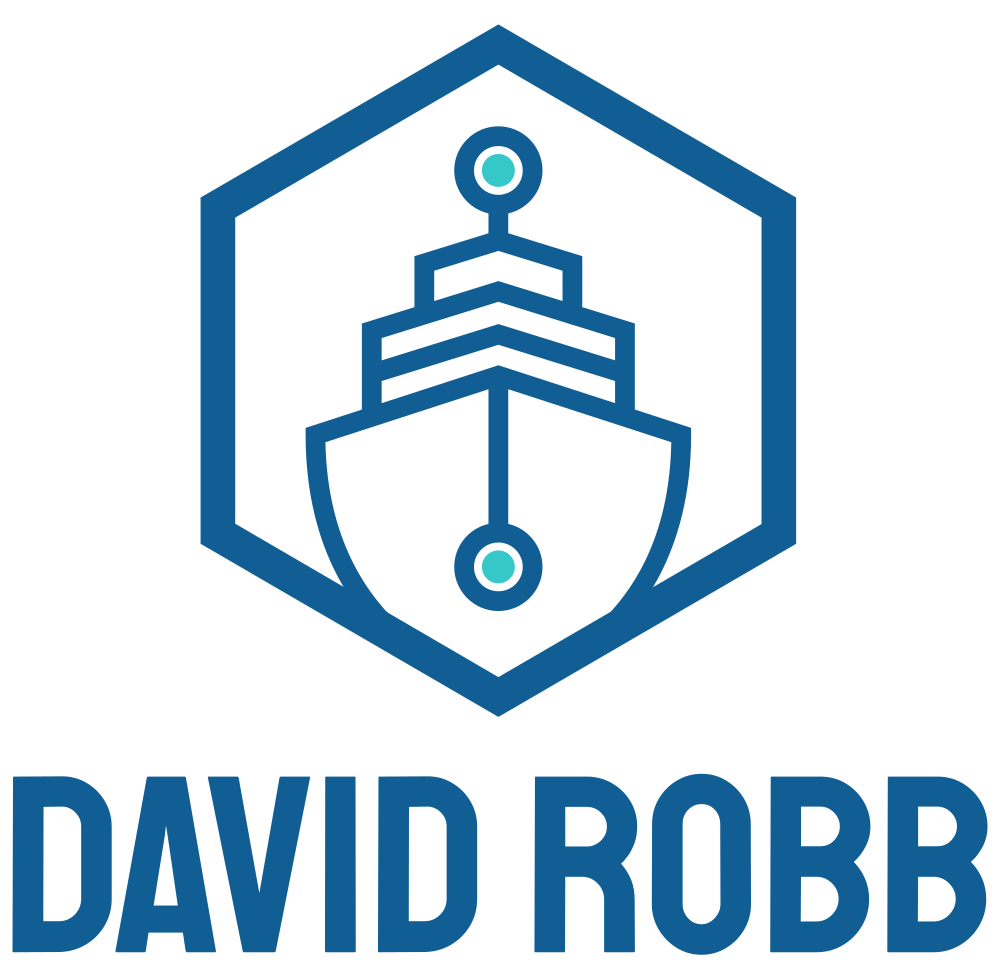

<div id="top"></div>
<!--
*** Thanks for checking out the Best-README-Template. If you have a suggestion
*** that would make this better, please fork the repo and create a pull request
*** or simply open an issue with the tag "enhancement".
*** Don't forget to give the project a star!
*** Thanks again! Now go create something AMAZING! :D
-->

<!-- PROJECT SHIELDS -->
<!--
*** I'm using markdown "reference style" links for readability.
*** Reference links are enclosed in brackets [ ] instead of parentheses ( ).
*** See the bottom of this document for the declaration of the reference variables
*** for contributors-url, forks-url, etc. This is an optional, concise syntax you may use.
*** https://www.markdownguide.org/basic-syntax/#reference-style-links
-->

[![Contributors][contributors-shield]][contributors-url]
[![Forks][forks-shield]][forks-url]
[![Stargazers][stars-shield]][stars-url]
[![Issues][issues-shield]][issues-url]
[![MIT License][license-shield]][license-url]
[![LinkedIn][linkedin-shield]][linkedin-url]

<!-- PROJECT LOGO -->
<br />
<div align="center">
  <a href="https://github.com/drobb2020/django-crm-2023">
    
  </a>

  <h3 align="center">django-crm-2023</h3>

  <p align="center">
    A simple CRM project presented by Codemy.com on YouTube.
    <br />
    <a href="https://github.com/drobb2020/django-crm-2023"><strong>Explore the docs »</strong></a>
    <br />
    <br />
    <a href="https://github.com/drobb2020/django-crm-2023">View Demo</a>
    ·
    <a href="https://github.com/drobb2020/django-crm-2023/issues">Report Bug</a>
    ·
    <a href="https://github.com/drobb2020/django-crm-2023/issues">Request Feature</a>
  </p>
</div>

<!-- TABLE OF CONTENTS -->
<details>
  <summary>Table of Contents</summary>
  <ol>
    <li>
      <a href="#about-the-project">About The Project</a>
      <ul>
        <li><a href="#built-with">Built With</a></li>
      </ul>
    </li>
    <li>
      <a href="#getting-started">Getting Started</a>
      <ul>
        <li><a href="#prerequisites">Prerequisites</a></li>
        <li><a href="#installation">Installation</a></li>
      </ul>
    </li>
    <li><a href="#usage">Usage</a></li>
    <li><a href="#contributing">Contributing</a></li>
    <li><a href="#license">License</a></li>
    <li><a href="#contact">Contact</a></li>
    <li><a href="#acknowledgments">Acknowledgments</a></li>
  </ol>
</details>

<!-- ABOUT THE PROJECT -->

## About The Project

[![Product Name Screen Shot][product-screenshot]](https://example.com)

<p align="right">(<a href="#top">back to top</a>)</p>

### Built With

This section should list any major frameworks/libraries used to bootstrap your project. Leave any add-ons/plugins for the acknowledgements section. Here are a few examples.

- [Python](https://python.org)
- [Django](https://www.djangoproject.com/)
- [Bootstrap](https://getbootstrap.com)

<p align="right">(<a href="#top">back to top</a>)</p>

<!-- GETTING STARTED -->

## Getting Started

### Prerequisites

Make sure you have Python installed on your system. This project was built using python 3.11.1, but should work with python 3.6 and above. Visit [Python.org](https://python.org) to download and install python.

### Installation

1. Create a Directory to hold the project
2. From within this folder create a python virtual environment

   ```sh
   python3 -m venv venv
   ```

3. Activate the virtual environment

   ```sh
   source venv/bin/activate (MacOS)
   venv/Scripts/activate (Windows)
   ```

4. Clone the repo

   ```sh
   git clone https://github.com/drobb2020/django-crm-2023.git
   ```

5. Install project dependencies

   ```sh
   pip install -r requirements.txt
   ```

6. Create a .env file based on the env.template, and populate the file with the settings for your system

7. Start playing by running the project

   ```sh
   python manage.py runserver
   ```

<p align="right">(<a href="#top">back to top</a>)</p>

<!-- USAGE EXAMPLES -->

## Usage

This is a great demo of CRUD operations in a Django application. It also uses PostgresQL as the backend database rather than the default sqlite3. There is definitely a lot of functionality that can be added to this project.

<p align="right">(<a href="#top">back to top</a>)</p>

See the [open issues](https://github.com/drobb2020/django-crm-2023/issues) for a full list of proposed features (and known issues).

<p align="right">(<a href="#top">back to top</a>)</p>

<!-- CONTRIBUTING -->

## Contributing

Contributions are what make the open source community such an amazing place to learn, inspire, and create. Any contributions you make are **greatly appreciated**.

If you have a suggestion that would make this better, please fork the repo and create a pull request. You can also simply open an issue with the tag "enhancement".
Don't forget to give the project a star! Thanks again!

1. Fork the Project
2. Create your Feature Branch (`git checkout -b feature/AmazingFeature`)
3. Commit your Changes (`git commit -m 'Add some AmazingFeature'`)
4. Push to the Branch (`git push origin feature/AmazingFeature`)
5. Open a Pull Request

<p align="right">(<a href="#top">back to top</a>)</p>

<!-- LICENSE -->

## License

Distributed under the MIT License. See `LICENSE.txt` for more information.

<p align="right">(<a href="#top">back to top</a>)</p>

<!-- CONTACT -->

## Contact

Your Name - [@davidrobb2](https://twitter.com/davidrobb2) - drobb2011@gmail.com

Project Link: [https://github.com/drobb2020/django-crm-2023](https://github.com/drobb2020/django-crm-2023)

<p align="right">(<a href="#top">back to top</a>)</p>

<!-- ACKNOWLEDGMENTS -->

## Acknowledgments

Thank you to John Elder of Codemy.com for creating this [YouTube tutorial](https://www.youtube.com/watch?v=IJnccWS_sCs&t=5885s)

- [Choose an Open Source License](https://choosealicense.com)
- [Img Shields](https://shields.io)

<p align="right">(<a href="#top">back to top</a>)</p>

<!-- MARKDOWN LINKS & IMAGES -->
<!-- https://www.markdownguide.org/basic-syntax/#reference-style-links -->

[contributors-shield]: https://img.shields.io/github/contributors/drobb2020/django-crm-2023.svg?style=for-the-badge
[contributors-url]: https://github.com/drobb2020/django-crm-2023/graphs/contributors
[forks-shield]: https://img.shields.io/github/forks/drobb2020/django-crm-2023.svg?style=for-the-badge
[forks-url]: https://github.com/drobb2020/django-crm-2023/network/members
[stars-shield]: https://img.shields.io/github/stars/drobb2020/django-crm-2023.svg?style=for-the-badge
[stars-url]: https://github.com/drobb2020/django-crm-2023/stargazers
[issues-shield]: https://img.shields.io/github/issues/drobb2020/django-crm-2023.svg?style=for-the-badge
[issues-url]: https://github.com/drobb2020/django-crm-2023/issues
[license-shield]: https://img.shields.io/github/license/drobb2020/django-crm-2023.svg?style=for-the-badge
[license-url]: https://github.com/drobb2020/django-crm-2023/blob/master/LICENSE.txt
[linkedin-shield]: https://img.shields.io/badge/-LinkedIn-black.svg?style=for-the-badge&logo=linkedin&colorB=555
[linkedin-url]: https://linkedin.com/in/othneildrew
[product-screenshot]: static/assets/screenshot.png
